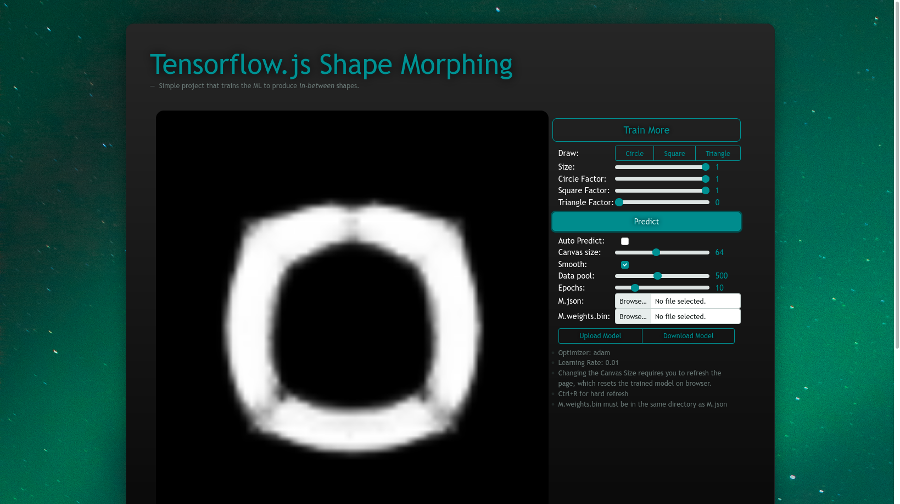
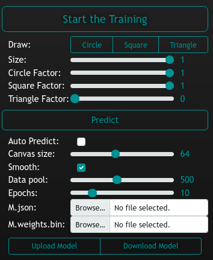

# [Tfjs Shape Morphing](https://clod44.github.io/tfjs-shape-morphing/)
 Tfjs simple in-between shape creator. 


 ## Table of Context
- TODO
- Depencies
- How to run
- How it works & Screenshots
- Notes

## TODO
- [x] Fix: TODO doesn't exists
- [ ] Fix: uploaded model's optimizer and learning rate is overwrited
- [ ] Feature: Being able to recompile the tfjs model
    - Able to change the optimizer
    - Able to change the learning rate
- [ ] Feature: Changing brush size
- [ ] Feature: User determined hidden layer sizes.
    - save the layer infos in file name
- [x] Improvement: User friendly frontend
- [ ] Improvement: Better way to handle uploaded model's required canvas size
- [ ] Improvement: Mobile Friendly website design
- [ ] Improvement: Remove P5js depency
- [ ] Improvement: Create a logo for the project

 ## Depencies
 - [Tensorflow.js 2.0.0](https://www.tensorflow.org/js) (cdn)
    - `tf.version`
- [P5.js 1.4.2](https://p5js.org/) (cdn)
    - `p5.prototype.VERSION`
- [Bootstrap v5.2.0](https://getbootstrap.com/) (cdn)

## How to run
### Online
Visit [here.](https://clod44.github.io/tfjs-shape-morphing/) (https://clod44.github.io/tfjs-shape-morphing/)
### Local
Clone the `stable` branch with  
```
git clone https://github.com/clod44/tfjs-shape-morphing/tree/stable
```
and double click `index.html`. Still requires internet access for cdns. 
        
## How it works
By pressing "Start the Training", it feeds the ml with different sized circles, squares and triangles and corrects the weights by drawing the particular shape in particular size and converting the canvas to a truth array. You can download or upload your model files to use them later / share. hidden layer size is determined by the canvas size. 





## Notes
I probably won't complete the TODO